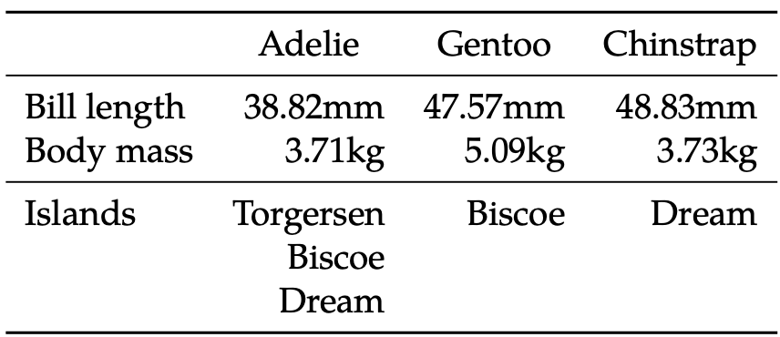

# LaTeXCarpenter.jl

This package creates LaTeX tables from structured Julia objects.

It is difficult to balance ease-of-use with flexibility when writing a table-printing package.
This is demonstrated by the existence of several similar packages in the Julia ecosystem, each offering a different level of generality.
I find the level of generality offered by this package useful for a variety of applications, from regression results to less structured statistics.
Please see the documentation for examples of the tables this package can generate.

## Design

The package assumes that data elements are organized by a 2-dimensional index: a source and a type.
Data is then presented (by default) such that all data of the same type share a row and data of the same source share a column (although it is possible to transpose the resulting table).
The conceptual difference between a source and a type is that all data of the same type (i.e., rows of the resulting table) is formatted the same way.

For example, the table below lists some statistics about penguins from [PalmerPenguins](https://allisonhorst.github.io/palmerpenguins/articles/intro.html).
Each column (`source`) contains information about a different species of penguin. Rows within a column represent different types of data.
Each row (`type`) contains data of the same type and is formatted the same way, but the values can differ across species.

|                | Adelie                   | Chinstrap | Gentoo |
|----------------|--------------------------|-----------|--------|
| Flipper length | 190mm                    | 196mm     | 217mm  |
| Body mass      | 3706g                    | 3733g     | 5092g  |
| Islands        | Torgerson, Biscoe, Dream | Dream     | Biscoe |

## Alternative packages

There are several other useful packages for generating LaTeX tables from Julia objects.

- [`PrettyTables.jl`](https://github.com/ronisbr/PrettyTables.jl) can print matrices with multiple formatting options and multiple output formats. 
- [`LaTeXTabulars.jl`](https://github.com/tpapp/LaTeXTabulars.jl) is a thin wrapper which allows you to essentially write LaTeX `tabular` environment code in Julia.
- [`LaTeXTables.jl`](https://github.com/szcf-weiya/LaTeXTables.jl) seems to be flexible but the documentation is currently limited.
- [`RegressionTables.jl`](https://github.com/jmboehm/RegressionTables.jl) is a fully-featured package for printing regression results to multiple output formats.
