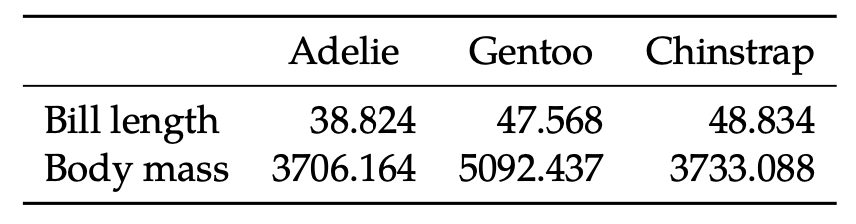
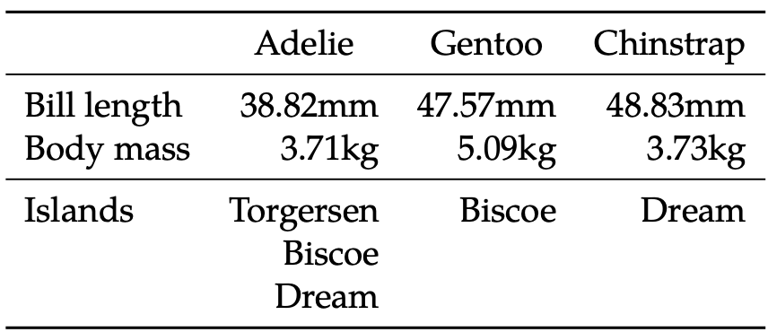

# LaTeXCarpenter.jl

This package creates LaTeX tables from Julia objects.
For example, the package can be used to produce regression tables or summary statistics from a dataframe.

The package design is based on data organized by a 2-dimensional index: a source and a tag.
Data is presented such that the sources form the table columns and the tags form the table rows.
For example, in a regression table, different specifications are the sources and regressors are the tags.

The example below illustrates the capabilities and design of the package using `DataFrames.jl` as a data source.

!!! warning "booktabs"
    Tables built by `LaTeXCarpenter.jl` require the ``\LaTeX`` `booktabs` package to be compiled.
    You need to add `\usepackage{booktabs}` in your  preamble whenever including tables produced from this
    package to your document.

## DataFrames.jl
We will use data from [PalmerPenguins.jl](https://allisonhorst.github.io/palmerpenguins/articles/intro.html) for the example.

```@example df
using LaTeXCarpenter, PalmerPenguins, DataFrames, Statistics
penguins = DataFrame(PalmerPenguins.load())
dropmissing!(penguins)
first(penguins, 5)
```

We create some summary statistics split by species.
```@example df
stats = combine(groupby(penguins, :species), 
                [:bill_length_mm, :body_mass_g] .=> mean,
                :island => Ref ∘ unique,
               )
```

Next we create a ``\LaTeX`` table containing the statistics.
```@example df
columns = [Column(row.species, row) for row in eachrow(stats)]
rows = [Row(:bill_length_mm_mean, "Bill length (mm)"),
        Row(:body_mass_g_mean, "Body mass (g)"),
       ]
print_latex_table(rows, columns)
```


### Indexing

`Column` and `Row` are two types exported by `LaTeXCarpenter.jl`.
Each instance of `Column` contains a label which is used for the column title and a data source, in this case a `DataFrameRow` from `DataFrames.jl`.
Each instance of `Row` contains an index, which is used to retrieve the data from each column, and a label which is used as the row title.
The data is extracted from the data source of each column using the row index via `getindex`, e.g., `row[:bill_length_mm_mean]`.
The ordering of `columns` and `rows` is respected in the produced table.

!!! warning "Missing keys"
    If the key for a row is not a valid index for some column, no `KeyError` will be thrown.
    The corresponding cell will simply be empty in the final table.
    This feature allows for columns which do not contain all rows to be included in the table, e.g., in regression tables with different coefficients for different specifications.

!!! tip "Swapping rows and columns"
    If you prefer the species to be on rows, then add the keyword `transpose=true`. 
    There is no need to modify the `rows` and `columns`.

### Formatting

The default formatting is to round real numbers to 3 decimal places but it is possible to specify a function to format each row.
This can be done either by supplying a function or a string to be passed to `Format.jl`.

```@example df
using Format
rows = [Row(:bill_length_mm_mean, "Bill length", "{:.2f}mm"),
        Row(:body_mass_g_mean, "Body mass", x -> format("{:.2f}kg", x / 1000)),
       ]
print_latex_table(rows, columns)
```


If the result of your formatting function is a collection other than an `AbstractString`, each element of the collection is printed on a new row.
```@example df
rows = [Row(:bill_length_mm_mean, "Bill length", "{:.2f}mm"),
        Row(:body_mass_g_mean, "Body mass", x -> format("{:.2f}kg", x / 1000)),
        Row(:island_Ref_unique, "Islands", identity),
       ]
print_latex_table(rows, columns; midrules=[2])
```


This allows us to add more information to table cells if we wish.
```@example df
using Format
make_stat(v) = (mean(v), std(v))
fmt_stat(tp) = (format("{:.2f}", tp[1]), format("({:.2f})", tp[2]))
stats = combine(groupby(penguins, :species), 
                [:bill_length_mm, :body_mass_g] .=> make_stat,
               )
columns = [Column(row.species, row) for row in eachrow(stats)]
rows = [Row(:bill_length_mm_make_stat, "Bill length (mm)", fmt_stat),
        Row(:body_mass_g_make_stat, "Body mass (g)", fmt_stat),
       ]
print_latex_table(rows, columns; suffix = "\\scriptsize Standard errors in parentheses.")
```


## Regression tables

Multi-row cells are used by the package when used to create a regression table.
```@example df
using GLM, QuantileRegressions, FixedEffectModels
transform!(penguins, :flipper_length_mm => ByRow(float) => :flipper_length_mm,
           :body_mass_g => ByRow(float) => :body_mass_g,
          )
regs = [lm(@formula(body_mass_g ~ bill_length_mm + flipper_length_mm + sex), penguins),
        qreg(@formula(body_mass_g ~ bill_length_mm + flipper_length_mm), penguins, 0.5),
        reg(penguins, @formula(body_mass_g ~ bill_length_mm + flipper_length_mm + fe(species)&fe(sex))),
       ]
print_regression_table(regs)
```


!!! tip "`get_regression_table_format`"
    Instead of outputting the final regression table, it is also possible to only output the `(rows, columns)` specification for customization using `get_regression_table_format`.
